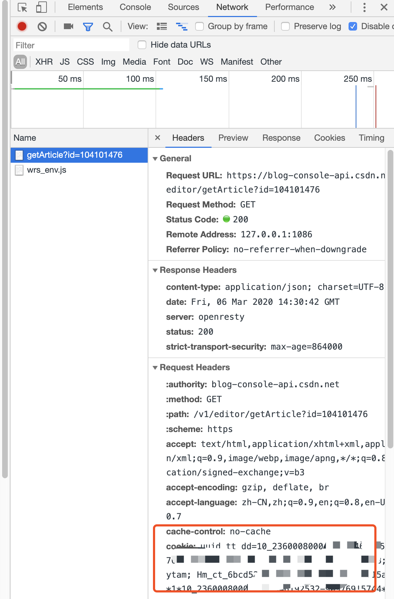
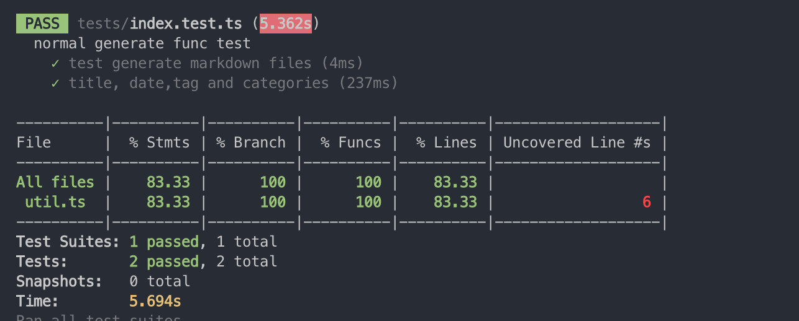

# CsdnSyncHexo

[![NPM version][npm-image]][npm-url]
[![build status][travis-image]][travis-url]
[![Test coverage][coveralls-image]][coveralls-url]
[![David deps][david-image]][david-url]
[![node version][node-image]][node-url]
[![npm download][download-image]][download-url]
[![npm license][license-image]][download-url]

[npm-image]: https://img.shields.io/npm/v/csdnsynchexo.svg?style=flat-square
[npm-url]: https://npmjs.org/package/csdnsynchexo
[travis-image]: https://img.shields.io/travis/flytam/CsdnSyncHexo.svg?style=flat-square
[travis-url]: https://travis-ci.org/flytam/CsdnSyncHexo
[coveralls-image]: https://img.shields.io/coveralls/flytam/CsdnSyncHexo.svg?style=flat-square
[coveralls-url]: https://coveralls.io/r/flytam/CsdnSyncHexo?branch=master
[david-image]: https://img.shields.io/david/flytam/CsdnSyncHexo.svg?style=flat-square
[david-url]: https://david-dm.org/flytam/CsdnSyncHexo
[node-image]: https://img.shields.io/badge/node.js-%3E=_8.0.0-green.svg?style=flat-square
[node-url]: http://nodejs.org/download/
[download-image]: https://img.shields.io/npm/dm/csdnsynchexo.svg?style=flat-square
[download-url]: https://npmjs.org/package/csdnsynchexo
[license-image]: https://img.shields.io/npm/l/csdnsynchexo.svg

一个方便的一键同步 csdn 博客上的内容到 hexo 源文件工具

### 使用

> 如果不想安装这个包直接使用可执行程序点[这里](https://github.com/flytam/blog-sync)

#### 更新日志

**_ v2.1.0 2020.3.6 更新 _** CSDN 修改了文章域名，2.1.0 以下版本已经不能用了，请更新

```bash
npm i -g csdnsynchexo@latest
```

v2.0 修复了一些问题

#### 全局安装

```bash
npm i -g csdnsynchexo
```

#### 命令行指定运行

```bash
hsync --output /Users/flytam/Desktop/coding/blog/source/_posts --base /Users/flytam/Desktop/coding/blog --csdn https://blog.csdn.net/flytam --cookie your_cookie_info
```

#### 配置文件运行 （推荐）

```json
// config.json
{
  "csdn": "https://blog.csdn.net/flytam", // csdn博客地址
  "output": "./example", // 这里可以定向到你的hexo源文件的地方
  "cookie": "xxxx", // cookie
  "base": "可选" // hexo博客源文件目录，用于执行hexo命令
}
```

```bash
// 指定配置文件
hsync --config ./config.json
```

#### 小白教程

#### 可执行程序

[参考](https://github.com/flytam/blog-sync)

#### 手动

#### FAQ

- 为什么需要 cookie 信息

拉取文章内容的接口在 csdn 中需要登录后的 cookie 信息。这个登录只要是任意用户登录就可以了。本来想过账号密码模拟登录的，但是网上的 csdn 文章模拟登录似乎已经不适用了。自己抓包后有几个字段不知道怎么构建，于是直接简单粗暴指定 cookie 了

- cookie 如何获取

最简单粗暴获取。登录后，点击将这个 [url](https://blog-console-api.csdn.net/v1/editor/getArticle?id=104101476)复制下面这段的 cookie 到配置文件或者指定运行。



#### 查看帮助

```bash
hsync --help
```

#### 已知 bug

~~1、解析代码块不太好~~

~~2、获取 csdn 文章的标签和分类有点问题~~

### ~~单元测试~~



~~npm run test~~

~~ps: 测试  用自己的 csdn 博客作为  例子进行测试~~

~~travis 不知道为什么。。好像有点问题~~

### license

MIT
