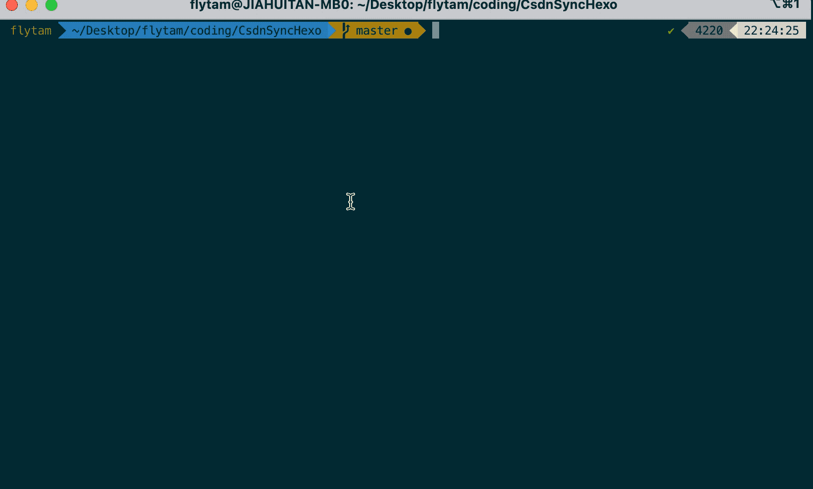

<h1 align="center">Welcome to csdnsynchexo 👋</h1>
<p>
  <a href="https://www.npmjs.com/package/csdnsynchexo" target="_blank">
    
  </a>
  <a href="https://github.com/flytam/CsdnSyncHexo#readme" target="_blank">
    
  </a>
  <a href="https://github.com/flytam/CsdnSyncHexo/graphs/commit-activity" target="_blank">
    
  </a>
    <a href="https://npmjs.org/package/csdnsynchexo" target="_blank">
    
  </a>
  <a href="https://github.com/flytam/CsdnSyncHexo/blob/master/LICENSE" target="_blank">
    
  </a>
</p>

> 支持 csdn/博客园/掘金/segmentfault/腾讯云加社区等平台一键迁移 hexo

### 🏠 [Homepage](https://github.com/flytam/CsdnSyncHexo#readme)

## Install

```sh
# > 3.0版本
npm i csdnsynchexo@latest
```

## Usage

```bash
# help
hsync --help
# 命令行
hsync --userId 289926799429704 --type juejin --output ./example
# or 指定配置文件
hsync --config ./config.json
{
  "userId": "289926799429704",
  "type": "juejin",
  "output": "./example"
}
```



#### 支持平台

**csdn**

- userId
  csdn 用户名。如`https://blog.csdn.net/flytam`的 flytam

- output
  输出路径。默认`.`

- cookie
  - csdn cookie 信息，不提供则使用爬虫获取；提供则 api 获取
  - 获取方式：新开一个页面，`F12(mac: cmd+shift+i)`打开控制台，[点击](https://blog-console-api.csdn.net/v1/editor/getArticle?id=104101476)抓包这个请求的`request headers`中的`cookie`后面那段值

**掘金** beta

- userId
  掘金用户 id。如`https://juejin.cn/user/289926799429704/posts`的`289926799429704`
- output
  输出路径。默认`.`

- cookie
  掘金 cookie 信息。不提供使用非鉴权 api，部分老文章 markdown 格式可能有问题

**鸦语** todo

**博客园** beta

- userId
  博客园用户 id。如`https://www.cnblogs.com/flytam/`的`flytam`
- output
  输出路径。默认`.`

**segmentfault** beta

- userId
  segmentfault id。如`https://segmentfault.com/u/flytam`的`flytam`
- output
  输出路径。默认`.`

**腾讯云加社区** doing

**github issue 写的博客** todo

#### TODO

- 部分平台有防盗链，需要支持一键转存图片
- 测试

## Run tests

```sh
npm run test
```

## Author

👤 **flytam**

- Website: github.com/flytam/blog
- Github: [@flytam](https://github.com/flytam)

## 🤝 Contributing

Contributions, issues and feature requests are welcome!<br />Feel free to check [issues page](https://github.com/flytam/CsdnSyncHexo/issues). You can also take a look at the [contributing guide](https://github.com/flytam/CsdnSyncHexo/blob/master/CONTRIBUTING.md).

## Show your support

Give a ⭐️ if this project helped you!

## 📝 License

Copyright © 2020 [flytam](https://github.com/flytam).<br />
This project is [MIT](https://github.com/flytam/CsdnSyncHexo/blob/master/LICENSE) licensed.
